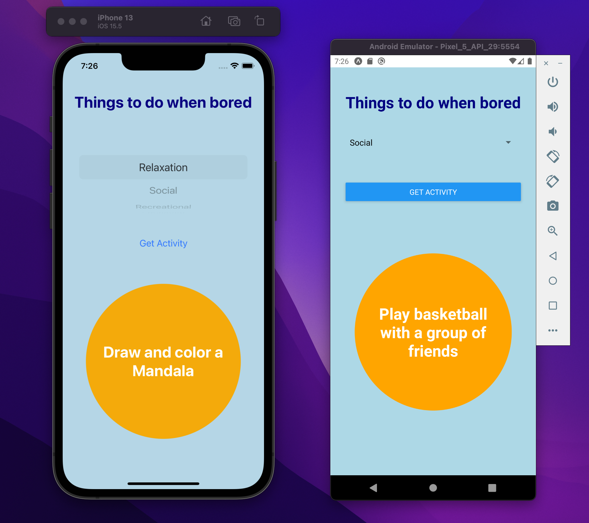

# BoredApp

## Table of contents
* [Working](#working)
* [General info](#general-info)
* [Technologies](#technologies)
* [Setup](#setup)

## Working
| Android  | Iphone |
| ------------- | ------------- |
|   |  |
|  |


## General info
* This App suggests things to do when you are feeling bored.
* It has a list of different categories to choose from like,
  Relaxation, Social, Educational etc.
	
## Technologies
Project is created with:
* React Native: 0.69
* BoredAPI: v1
	
## Setup
To run this project, install it locally using npm:

download or clone the repository

```
$ npm install
$ npm start
```
